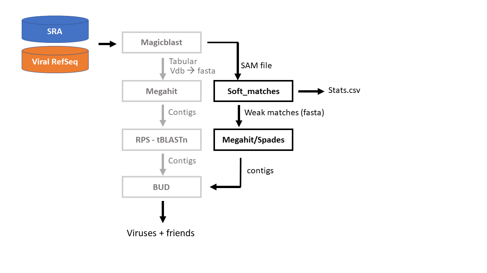
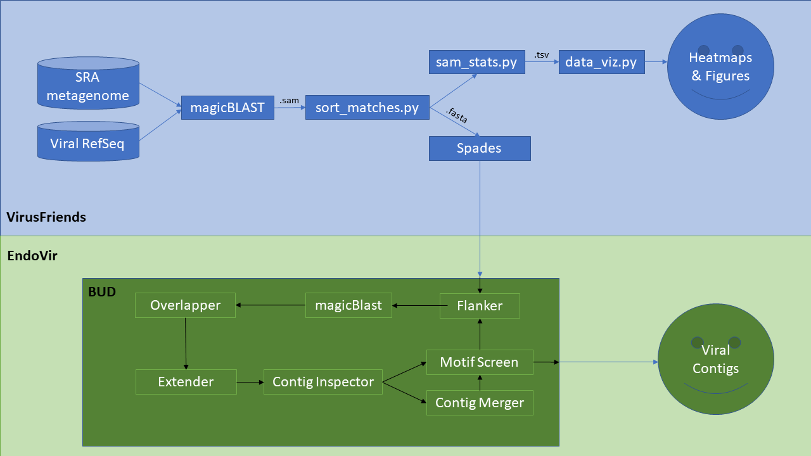

# VirusFriends: discover viral sequences in the NCBI SRA!


## Please cite our work! DOI:DOI 10.17605/OSF.IO/Z4BCN 
### https://osf.io/4cn3j/

## It's always sunny when you have phage friends, too


## VirusFriends is an implementation to discover viruses that are slightly related to already known ones. 
The idea is to use the genomes of known viruses as anchors to expand the viral sequence space. 

## Why VirusFriends?
It's being estimated that there are 3x10^31 viral particles in the world, but only ~9,500 viral genomes have being described at a genomic level. This means there is a huge amount of viruses to be discovered! 

VirusFriends is a bioinformatics tool that discovers viruses in Whole Shotgun Sequence metagenomic samples in the Sequence Read Archive.  In addition to identification and quantification of known viruses in metagenomes, VirusFriends also allows for identification of novel viruses in metagenomic samples. VirusFriends uses Magic-BLAST to screen metagenomes from the SRA for presence of reads that map to the NCBI Viral RefSeq database or a custom user-specified reference database. For a given reference, statistics are output that include read coverage, and numbers of reads mapped at various levels of sequence identity. Novel viruses are identified by de-novo assembly and iteratively searching for reads that map to the 5’ and 3’ ends of a given contig to extend the contig’s length.

# What is VirusFriends?

This is an implementation that is inpired on work developed on previous NCBI-hackatons as part of the Virus Discovery Project, the natural histor of this work is: SIDEARM --> Virome Sniff --> ViruSpy --> EndoVir --> VirusFriends
VirusFriends is the latest stage of the [Virus Discovery Project] (https://osf.io/4cn3j/) developed at several NCBI-sponsored hackathons 

##Pipeline 


##Use Cases

###HIV

###Ebola

###crAssphage

###Picobirnavirus

###VirusFriends with any nucleotides database

##Quick Start

##Dependencies

Python 3.5 
Megahit v1.1.2
Blast 2.7 
SPAdes v3.11.1
Samtools 1.6
Biopython v.
Sra-toolkit v.2.8.2
git version 2.7.4
Pysam 0.13

##Stats on good and weak hits

##Installation 
Overview Diagram

Step 1. Screen a set of SRA datasets for viral reference genomes and keep the "very good" hits and "weak hits"

Input: [a list of SRA ids] [a fasta file with the viral database]
Output: sam files, fasta files for weak viral hits, stats about number of hits, identity, etc ... for strong and weak hits

Step 2: Weak hits go into denovo assembly, viral motifs search and extension of the contigs
Input: [fasta file of weak hits]
Output: enriched contigs, weakly related to known viruses

# How to use <this software>

## Installation options:

We provide two options for installing <this software>: Docker or directly from Github.

### Docker

The Docker image contains <this software> as well as a webserver and FTP server in case you want to deploy the FTP server. It does also contain a web server for testi
ng the <this software> main website (but should only be used for debug purposes).

1. `docker pull ncbihackathons/<this software>` command to pull the image from the DockerHub
2. `docker run ncbihackathons/<this software>` Run the docker image from the master shell script
3. Edit the configuration files as below

### Installing <this software> from Github

1. `git clone https://github.com/NCBI-Hackathons/<this software>.git`
2. Edit the configuration files as below
3. `sh server/<this software>.sh` to test
4. Add cron job as required (to execute <this software>.sh script)

### Configuration

```Examples here```

# Testing

We tested four different tools with <this software>. They can be found in [server/tools/](server/tools/) .

# Additional Functionality

### DockerFile

<this software> comes with a Dockerfile which can be used to build the Docker image.

  1. `git clone https://github.com/NCBI-Hackathons/<this software>.git`
  2. `cd server`
  3. `docker build --rm -t <this software>/<this software> .`
  4. `docker run -t -i <this software>/<this software>`

### Website

There is also a Docker image for hosting the main website. This should only be used for debug purposes.

  1. `git clone https://github.com/NCBI-Hackathons/<this software>.git`
  2. `cd Website`
  3. `docker build --rm -t <this software>/website .`
  4. `docker run -t -i <this software>/website`

### How does this relate to previous work?

Our hackathon project is build on the shoulders of many other good projects. The closest relative to this project is [EndoVir](https://github.com/NCBI-Hackathons/EndoVir/tree/master) and our relationship to this project can be seen in the figure below. This project also has deeper roots in [ViruSpy](https://github.com/NCBI-Hackathons/ViruSpy/tree/master), [Virus Domains](
https://github.com/NCBI-Hackathons/Virus_Domains/tree/master), and [Virus_Detection_SRA](https://github.com/NCBI-Hackathons/Virus_Detection_SRA/tree/master). An overview of this history can be seen [here](https://osf.io/4cn3j/) and our relationship to EndoVir can be seen below.



